# OPFG — FAMILY MARINE BLUEPRINT V2 — MINI-ARCS

> **Status:** production blueprint candidate.
>
> **Scope:** Childhood portion of `family_marine`.
>
> This document defines the **47 structural Major roots** and the internal **Immediate mini-arcs** they open. It is not runtime JSON.
>
> Runtime/design authority remains:
>
> - `docs/design/MAJOR_NARRATIVE_TRACKS.md`
> - `docs/content/EVENT_AUTHORING_RULES.md`
> - `docs/GAME_DESIGN.md`
> - `docs/content/CONTENT_BIBLE.md`

---

# 1. Production lock

## 1.1 Five layers = five family mini-stories

The player starts exactly one `family_marine` Major root in each Childhood layer:

| Layer | Due | Lived unit |
|---|---:|---|
| `childhood_01` | 12 months | 1 Family mini-arc |
| `childhood_02` | 48 months | 1 Family mini-arc |
| `childhood_03` | 84 months | 1 Family mini-arc |
| `childhood_04` | 120 months | 1 Family mini-arc |
| `childhood_05` | 156 months | 1 Family inheritance mini-arc |

The exact due ages are therefore **1 / 4 / 7 / 10 / 13 years**.

A structural Major node is normally:

```text
Normal root carrying majorTrack
→ Immediate reaction
→ optional Immediate confrontation / Dice beat
→ Immediate resolution
```

Only the Normal root owns `majorTrack`.

## 1.2 Narrative thesis

> The Marine claims to protect the household. What happens when duty begins to claim the family itself — and eventually the child?

The Saga must allow all of the following without contradiction:

- love the father and reject the institution;
- reject the father while still believing in the Marine;
- accept Marine duty but redefine obedience;
- reject a Marine future without erasing Marine family origin;
- accept a Marine future because of the family;
- accept it despite the family;
- turn inherited prestige into responsibility;
- turn inherited prestige into resentment.

## 1.3 Family identity

V1 Marine single-parent sex:

```ts
marine: 'male'
```

Thus:

- `two_parents` → father + mother;
- `single_parent` → father;
- `orphan` → neither;
- later NPC status may make a structurally present parent currently absent.

The father is the central recurring parent for the Marine Saga. In `two_parents`, the mother must be an independent dramatic actor whenever she is present in the scene.

## 1.4 Mechanical rhythm

Family consequences are evaluated over the **whole mini-arc**, not every panel.

Preferred whole-arc packages:

```text
+2 / -2
+2 / -1
+2 / -2 / +1
+2 / +1 / -1
```

Relationship movement:

```text
ordinary meaningful family beat      ±3..5
major rupture / reconciliation        ±8..12
```

A useful rhythm:

```text
Root          → intent, usually no or small effect
Immediate 1   → reaction / relationship pressure
Immediate 2   → DiceCheck or hard decision
Resolution    → main Stat package / relationship change / persistent memory
```

## 1.5 Layer-5 rule

Every reachable terminal Outcome grants at least one persistent gameplay reward.

Achievements / `milestoneId` do not count as gameplay rewards.

Every Layer-5 terminal also records an **Active handoff intent**:

```text
marine
or
civilian
```

This does not rewrite inherited family affiliation.

---

# 2. Pyramid map

```text
A — HOME UNDER THE UNIFORM
    high-yield entry: single-parent household
    core pressure: duty takes time and presence from the home

B — THE FAMILY NAME
    broad/default Marine-family entry
    core pressure: prestige, expectation and inherited institutional identity

C — A PLACE NOT DESIGNED FOR YOU
    high-yield entry: non-human child
    core pressure: belonging to an institution built around Human norms

G — GIANT × MARINE
    Special Association growing from C
    core pressure: Marine fascination with Giant military potential
```

Crossings are explicit. A player may begin in C, cross into A through single-parent pressure, later rejoin B through prestige, then finish on a shared inheritance.

---

# 3. Global structural graph

```mermaid
flowchart TB

  subgraph L1["L1 · 12m"]
    A1["A1 · Avant l'aube"]
    B1["B1 · Le fanion du foyer"]
    C1["C1 · Aucune case pour toi"]
  end

  subgraph L2["L2 · 48m"]
    A2A["A2A · La chaise vide"]
    A2B["A2B · Tu viens à la base"]
    B2A["B2A · Le dîner interrompu"]
    C2A["C2A · À ta mesure"]
    C2B["C2B · Hors du carré"]
    G2["G2 ★ · Le mètre de l'intendance"]
    X2["X2 ◇ · Derrière la porte du bureau"]
    F2A["F2A · La maison sous la pluie"]
    F2B["F2B · Les jetons de solde"]
    F2C["F2C · Une place à table"]
  end

  subgraph L3["L3 · 84m"]
    A3["A3 · Il ne rentre pas"]
    B3A["B3A · Le paquet scellé"]
    B3B["B3B · Le nom de ton père"]
    C3A["C3A · Le mauvais ordre"]
    C3B["C3B · Pas sur la liste"]
    O3["O3 · Le vieux sergent"]
    G3A["G3A ★ · La démonstration"]
    G3B["G3B ★ · Pas une attraction"]
    X3["X3 ◇ · Ce que la Marine protège"]
    F3A["F3A · La maison tient"]
    F3B["F3B · Le service en héritage"]
    F3C["F3C · Trouver sa place"]
  end

  subgraph L4["L4 · 120m"]
    A4["A4 · Le rapport contre lui"]
    B4A["B4A · Ils parlent déjà de ton uniforme"]
    B4B["B4B · La dispute derrière la cloison"]
    C4A["C4A · Garde ça pour toi"]
    C4B["C4B · Dis-nous ce que Marine signifie"]
    O4["O4 · Son nom sur le mur"]
    G4A["G4A ★ · Une offre trop tôt"]
    G4B["G4B ★ · Le Géant qu'on montre"]
    X4["X4 ◇ · Protéger ou obéir"]
    F4A["F4A · Ce que coûte le devoir"]
    F4B["F4B · Ce que porte le nom"]
    F4C["F4C · Ce qu'on attend de toi"]
  end

  subgraph L5["L5 · 156m"]
    H5D["H5D · L'insigne dans la paume"]
    H5F["H5F · Ton avenir t'appartient"]
    H5A["H5A · Le coffre qu'il a laissé"]
    H5P["H5P · Porte-le mieux que moi"]
    H5R["H5R · Le devoir n'est pas l'obéissance"]
    H5X["H5X · Notre nom ne leur appartient pas"]
    H5M["H5M · Ce qu'il reste de lui"]
    H5S["H5S · Décide toi-même"]
    H5C["H5C · Ton nom sur le registre"]
    H5G["H5G ★ · À tes conditions"]
  end

  A1 --> A2A
  A1 --> A2B
  A1 --> X2
  A1 --> F2A

  B1 --> B2A
  B1 --> X2
  B1 --> F2B

  C1 --> C2A
  C1 --> C2B
  C1 --> G2
  C1 --> X2
  C1 --> F2C

  A2A --> A3
  A2A --> F3A
  A2B --> A3
  A2B --> B3A
  A2B --> X3
  A2B --> F3A
  B2A --> B3A
  B2A --> B3B
  B2A --> X3
  B2A --> F3B
  C2A --> C3B
  C2A --> X3
  C2A --> F3C
  C2B --> C3A
  C2B --> C3B
  C2B --> F3C
  G2 --> G3A
  G2 --> G3B
  G2 --> F3C
  X2 --> C3A
  X2 --> X3
  X2 --> F3B
  F2A --> A3
  F2A --> F3A
  F2B --> B3B
  F2B --> O3
  F2B --> F3B
  F2C --> C3B
  F2C --> F3C

  A3 --> A4
  A3 --> B4B
  A3 --> F4A
  B3A --> A4
  B3A --> B4A
  B3A --> F4A
  B3B --> B4A
  B3B --> F4B
  C3A --> C4A
  C3A --> X4
  C3A --> F4C
  C3B --> C4B
  C3B --> X4
  C3B --> F4C
  O3 --> O4
  O3 --> F4B
  G3A --> G4A
  G3A --> F4C
  G3B --> G4B
  G3B --> F4C
  X3 --> A4
  X3 --> X4
  X3 --> F4C
  F3A --> A4
  F3A --> F4A
  F3B --> B4A
  F3B --> B4B
  F3B --> F4B
  F3C --> C4B
  F3C --> X4
  F3C --> F4C

  A4 --> H5P
  A4 --> H5R
  A4 --> H5D
  B4A --> H5P
  B4A --> H5C
  B4A --> H5D
  B4B --> H5M
  B4B --> H5X
  B4B --> H5A
  C4A --> H5R
  C4A --> H5X
  C4A --> H5F
  C4B --> H5R
  C4B --> H5S
  C4B --> H5F
  O4 --> H5M
  O4 --> H5A
  G4A --> H5G
  G4A --> H5C
  G4A --> H5D
  G4B --> H5X
  G4B --> H5S
  G4B --> H5F
  X4 --> H5R
  X4 --> H5S
  X4 --> H5F
  F4A --> H5P
  F4A --> H5D
  F4B --> H5M
  F4B --> H5A
  F4C --> H5S
  F4C --> H5F
```



---

# 4. Layer 1 — earliest family anchor

## A1 — `family_marine_01_before_dawn`
### Avant l'aube

**Eligibility**
- `familyStructureIs(single_parent)`
- father currently present
- priority 20

**Root situation**
A recall order reaches the house before dawn. Father dresses for duty while the one-year-old player is awake. Nobody else will remain in the home with them.

**Mini-arc**
1. **Root — Avant l'aube**
   - player reacts: cling / help / stare.
   - all choices queue the same reaction Event with different History.
2. **Immediate — La porte reste ouverte**
   - father notices the reaction and hesitates long enough for the household cost to become explicit.
   - if cling: he tries to detach the child's hand.
   - if help: he asks the child to pass one last object.
   - if stare: he realizes the child has understood more than expected.
3. **Immediate — Après ses pas**
   - resolution after the door shuts: caretaker/neighbor pickup or empty-room beat.
   - main mechanical package lands here.

**Primary History signatures**
- `a1_retenu_pere`
- `a1_aide_depart`
- `a1_observe_depart`

**Mechanical target**
- cling: `Charisma +2 / Morale -2`, father Rel `-5` or conflicted.
- help: `Intelligence +2 / Morale -2`, father Rel `+5`.
- stare: `Observation +2 / Charisma -2`.

**Feeds**
- cling → A2A strongly.
- help → A2B strongly.
- stare → X2 strongly.
- all → F2A safety.

---

## B1 — `family_marine_01_family_pennant`
### Le fanion du foyer

**Eligibility**
- Layer-1 fallback root.

**Root situation**
A Marine visitor brings a small family pennant for a local service ceremony and sets it within the child's reach while speaking to the adult/caretaker.

**Mini-arc**
1. **Root — Le fanion du foyer**
   - grab / return / inspect.
2. **Immediate — Le tissu bleu**
   - visitor reacts to what the child did.
   - if grabbed: amused pride.
   - if returned: adult approval.
   - if inspected: visitor points out insignia details.
3. **Immediate — À la fenêtre**
   - the pennant is fixed in the home; player sees how adults react to it.
   - establishes whether the Marine symbol feels prestigious, ordinary, or alien.

**History signatures**
- `b1_fascination_symbole`
- `b1_respect_symbole`
- `b1_curiosite_symbole`

**Mechanical target**
- fascination: `Morale +2 / Observation -2`.
- respect: `Intelligence +2 / Morale -1`.
- curiosity: `Observation +2 / Morale -1 / Intelligence +1`.

**Feeds**
- fascination/respect → B2A.
- curiosity → X2.
- all → F2B.

---

## C1 — `family_marine_01_no_box_on_form`
### Aucune case pour toi

**Eligibility**
- Fish-Man / Mink / Giant
- priority 30

**Root situation**
At a base family registration/medical check, the clerk discovers that the standard Human form, chair or measuring setup does not fit the player.

**Mini-arc**
1. **Root — Aucune case pour toi**
   - cooperate / push the tool away / watch the clerk improvise.
2. **Immediate — On improvise**
   - adults physically adapt the setup.
   - father may intervene if present.
3. **Immediate — Le carnet corrigé**
   - the clerk creates a new handwritten notation/category for the child.
   - **Giant-only available Choice:** deliberately stretch out and invite the measurement rather than merely tolerate it.
   - this is the hook for G2.

**History signatures**
- `c1_accepte_adaptation`
- `c1_refuse_adaptation`
- `c1_etudie_adaptation`
- `c1_giant_se_laisse_mesurer` — Giant special hook.

**Mechanical target**
- cooperate: `Morale +2 / Observation -1 / Charisma +1`.
- resist: `Morale +2 / Charisma -2 / Agility +1`.
- observe: `Observation +2 / Morale -1 / Intelligence +1`.

**Feeds**
- cooperate → C2A; if single-parent also A2B.
- resist → C2B.
- observe → X2.
- Giant special hook → G2.
- all → F2C.

---

# 5. Layer 2 — first development

## A2A — `family_marine_04_empty_chair`
### La chaise vide

**Parents**
- A1

**Eligibility emphasis**
- A1 cling/protest history.
- father currently present.
- priority 20.

**Root**
Father promised to attend a small neighborhood event. Everyone has arrived. His chair remains empty after the second shift bell.

**Mini-arc**
1. **Root:** keep the chair / fold it / tell the adults he promised.
2. **Immediate — On commence sans lui**
   - event begins; someone tries to take/move the empty chair.
3. **Immediate — Il arrive trop tard**
   - father arrives at the end or shortly after.
   - player decides whether to confront, ignore, or show what he missed.
4. **Resolution**
   - relationship movement and archetype package.

**History**
- `a2a_attend_encore`
- `a2a_range_promesse`
- `a2a_nomine_promesse`
- `a2a_confronte_retard`
- `a2a_protege_pere_devant_autres`

**Dice**
Optional Charisma check on publicly confronting him.

**Feeds**
- hurt/abandonment → A3.
- public confrontation → B4B seed later through descendants.
- reconciliation → F3A.

---

## A2B — `family_marine_04_you_come_to_base`
### Tu viens à la base

**Parents**
- A1, C1

**Eligibility emphasis**
- single-parent household.
- father present.
- route from A1 help OR C1 cooperative adaptation.
- priority 20.

**Root**
Nobody can watch the player. Father leaves them behind the base storehouse with chalk and one clear boundary.

**Mini-arc**
1. **Root:** stay useful / follow boots / ask the quartermaster for work.
2. **Immediate — Au-delà de la ligne jaune**
   - exploration or work starts.
3. **Immediate — La sirène courte**
   - a short base alarm changes everyone's movement.
   - player must react with age-appropriate agency.
4. **Resolution — Retrouver père**
   - father returns to find what the child did.
   - Relationship consequence.

**Dice**
Observation/Agility on following movement during alarm.

**History**
- `a2b_respecte_consigne`
- `a2b_explore_base`
- `a2b_se_rend_utile`
- `a2b_reagit_a_alerte`
- `a2b_pere_fier`
- `a2b_pere_inquiet`

**Feeds**
- responsibility → B3A.
- fear of absence → A3.
- institutional exposure → X3.
- safety → F3A.

---

## B2A — `family_marine_04_dinner_interrupted`
### Le dîner interrompu

**Parents**
- B1

**Eligibility emphasis**
- two parents present.
- priority 20.

**Root**
A messenger interrupts dinner. Father reaches for his coat; mother reminds him he promised to stay.

**Mini-arc**
1. **Root:** pull father back / push his plate toward him / say “reste”.
2. **Immediate — Deux adultes, deux devoirs**
   - father and mother directly disagree.
3. **Immediate — Le messager attend**
   - the messenger is still at the door, so the family must decide while the institution literally waits.
4. **Resolution — La porte**
   - father leaves, stays, or negotiates a delay.
   - relationship shifts may affect both parents in opposite directions.

**Dice**
Charisma on trying to make both adults listen.

**History**
- `b2a_soutient_mere`
- `b2a_soutient_pere`
- `b2a_force_discussion`
- `b2a_pere_part`
- `b2a_pere_reste`
- `b2a_compromis`

**Feeds**
- entrusted duty → B3A.
- prestige/expectation → B3B.
- compromise/protective ideal → X3.
- generic → F3B.

---

## C2A — `family_marine_04_made_to_fit`
### À ta mesure

**Parents**
- C1

**Eligibility**
- cooperative/adaptation history.

**Root**
A Marine tailor/craftsman opens seams and straps on a small practice garment or kit so it actually fits the player's body.

**Mini-arc**
1. **Root:** explain what hurts / choose fastenings / stay still.
2. **Immediate — Premier essayage**
   - first adaptation fails in a concrete way.
3. **Immediate — Corriger ensemble**
   - player contributes to the fix rather than being passively handled.
4. **Resolution — Ça tient**
   - positive Race experience without pretending the institution is universally inclusive.

**History**
- `c2a_explique_besoin`
- `c2a_co_construit_solution`
- `c2a_supporte_adaptation`
- `c2a_marine_a_su_adapter`

**Dice**
Optional Intelligence/Agility on testing the altered kit.

**Feeds**
- belonging/adaptation → C3B.
- trust in institution → X3.
- fallback → F3C.

---

## C2B — `family_marine_04_off_drill_square`
### Hors du carré

**Parents**
- C1

**Eligibility**
- resistant history.

**Root**
Children of Marines draw a drill square. One blocks the player because the available equipment/rules “aren't for them”.

**Mini-arc**
1. **Root:** draw own square / enter anyway / watch from the edge.
2. **Immediate — Le jeu s'arrête**
   - every response forces other children to react.
3. **Immediate — Un adulte voit la scène**
   - Marine adult or parent arrives and interprets what happened.
4. **Resolution**
   - player can accept adult intervention, reject it, or insist on their own solution.

**Dice**
Morale or Agility for entering/reworking the drill under pressure.

**History**
- `c2b_invente_regles`
- `c2b_force_entree`
- `c2b_apprend_du_bord`
- `c2b_adulte_defend`
- `c2b_adulte_minimise`

**Feeds**
- institutional harm → C3A.
- exclusion/belonging → C3B.
- fallback → F3C.

---

## G2 — `family_marine_04_quartermaster_measure`
### Le mètre de l'intendance

**Parents**
- C1

**Eligibility**
- Giant.
- `c1_giant_se_laisse_mesurer`.
- `specialPathId: marine_giant`.
- priority 30.

**Root**
A quartermaster deliberately records the child's height, reach and expected growth.

**Mini-arc**
1. **Root:** cooperate proudly / ask why / stop the measurement.
2. **Immediate — Le carnet**
   - player sees that this is not a one-off measurement: other Giant-related notes exist.
3. **Immediate — « Utile à suivre »**
   - officer admits the Marine watches Giant military potential.
4. **Immediate — Devant ton père**
   - if father present, officer asks permission to call the child back later.
   - player can claim the choice, let father answer, or refuse.
5. **Resolution**
   - decides whether Special Path continues toward G3A, G3B, or exits to F3C.

**Dice**
Charisma to force a direct answer from officer.

**History**
- `g2_accepte_test`
- `g2_demande_usage`
- `g2_refuse_objet`
- `g2_pere_accepte_suivi`
- `g2_joueur_pose_limite`

**Mechanical target**
Whole arc should push Strength/Morale/Charisma in a balanced way, not simply buff Giant strength.

**Feeds**
- accepts test while retaining agency → G3A.
- resists objectification → G3B.
- exits special route → F3C.

---

## X2 — `family_marine_04_behind_office_door`
### Derrière la porte du bureau

**Parents**
- A1, B1, C1

**Eligibility**
- observant/curious Layer-1 histories.
- father present.
- priority 10.

**Root**
The player waits in a base corridor while father refuses an order behind a closed door.

**Mini-arc**
1. **Root:** listen / call father / leave quietly.
2. **Immediate A — Quelques mots de trop**
   - listening reveals civilians or a questionable patrol target.
3. **Immediate B — La porte s'ouvre**
   - father/superior catches or addresses the child.
4. **Immediate — Pourquoi tu as dit non ?**
   - player can ask father directly once outside.
5. **Resolution**
   - learns the reason, gets a partial answer, or is shut out.

**Dice**
Observation to understand the dispute; Agility to avoid discovery.

**History**
- `x2_entend_ordre`
- `x2_entend_raison_pere`
- `x2_surpris_espionner`
- `x2_pere_explique`
- `x2_pere_refuse_expliquer`

**Feeds**
- father/institution contradiction → C3A.
- protective justification → X3.
- partial unresolved memory → F3B.

---

## F2A — `family_marine_04_fallback_home`
### La maison sous la pluie

**Parents**
- A1
- fallback.

**Root**
Rain comes under the threshold while father's service coat hangs near the leak.

**Mini-arc**
1. **Root:** save coat / empty basin / protect floor.
2. **Immediate — Il faut choisir**
   - consequence of first choice becomes visible.
3. **Resolution**
   - father returns or neighbor helps; small but concrete callback to household responsibility.

**Mechanical target**
2 panels minimum, balanced self-reliance.

**Feeds**
- A3 or F3A.

---

## F2B — `family_marine_04_fallback_service`
### Les jetons de solde

**Parents**
- B1
- fallback.

**Root**
At pay distribution, two nearly identical household tokens are on the counter.

**Mini-arc**
1. **Root:** inspect / guess / ask to verify.
2. **Immediate — Le registre**
   - adult either checks the record or asks how the player knew.
3. **Resolution**
   - builds relation to institutional routine rather than ideology.

**Dice**
Observation or Luck.

**Feeds**
- B3B, O3, F3B.

---

## F2C — `family_marine_04_fallback_adaptation`
### Une place à table

**Parents**
- C1
- fallback.

**Root**
A base family table does not fit the player's body. An adult proposes a clumsy solution.

**Mini-arc**
1. **Root:** improvise / accept help / stand.
2. **Immediate — Tout le monde bouge**
   - the physical consequence of the choice becomes visible.
3. **Resolution**
   - establishes whether adaptation feels collaborative, humiliating, or self-made.

**Feeds**
- C3B or F3C.

---

# 6. Layer 3 — family identity at seven

## A3 — `family_marine_07_no_return`
### Il ne rentre pas

**Parents**
- A2A, A2B, F2A.

**Root**
Father's patrol is overdue and no useful answer reaches the household.

**Mini-arc**
1. Root: wait at door / go to base / prepare the house.
2. Immediate: rumor arrives before official news.
3. Immediate: player chooses whether to believe rumor, demand facts, or protect someone else from panic.
4. Resolution: father returns injured/exhausted, or remains absent long enough to leave a deeper wound without necessarily dying.

**Dice**
Charisma/Observation depending on base inquiry.

**History**
- `a3_panique_absence`
- `a3_demande_faits`
- `a3_tient_foyer`
- `a3_pere_revient_blesse`
- `a3_pere_revient_sans_expliquer`

**Feeds**
- A4 / B4B / F4A.

---

## B3A — `family_marine_07_sealed_packet`
### Le paquet scellé

**Parents**
- A2B, B2A.

**Root**
A sealed service packet is temporarily entrusted to the household/player while an adult is interrupted.

**Mini-arc**
1. Root: guard / peek / hand it to someone else.
2. Immediate: someone arrives asking for it without proper proof.
3. Immediate: Dice or hard decision over verification.
4. Resolution: packet reaches correct hands, is opened, or causes distrust.

**Dice**
Observation/Intelligence.

**History**
- `b3a_protege_paquet`
- `b3a_ouvre_paquet`
- `b3a_verifie_destinataire`
- `b3a_fait_confiance`

**Feeds**
- A4 / B4A / F4A.

---

## B3B — `family_marine_07_fathers_name`
### Le nom de ton père

**Parents**
- B2A, F2B.

**Root**
An officer praises the player before they have done anything because of father's record.

**Mini-arc**
1. Root: accept praise / correct officer / boast.
2. Immediate: another child objects that the player did nothing.
3. Immediate: player reacts to first public challenge to inherited prestige.
4. Resolution: officer either doubles down or recognizes the distinction.

**History**
- `b3b_accepte_nom`
- `b3b_refuse_merite_herite`
- `b3b_utilise_prestige`
- `b3b_veut_prouver_par_soi`

**Feeds**
- B4A / F4B.

---

## C3A — `family_marine_07_bad_order`
### Le mauvais ordre

**Parents**
- C2B, X2.

**Root**
Father or another Marine executes a lawful order that visibly harms someone local.

**Mini-arc**
1. Root: confront / help victim / stay beside father.
2. Immediate: Marine explains rule while affected person reacts.
3. Immediate: player faces contradiction between legality and fairness.
4. Resolution: father may defend, regret, or refuse discussion.

**Dice**
Charisma if confronting authority.

**History**
- `c3a_soutient_ordre`
- `c3a_aide_victime`
- `c3a_confronte_pere`
- `c3a_pere_regrette`
- `c3a_pere_assume`

**Feeds**
- C4A / X4 / F4C.

---

## C3B — `family_marine_07_not_on_list`
### Pas sur la liste

**Parents**
- C2A, C2B, F2C.

**Root**
A Marine-family activity has no prepared category/equipment slot for the player.

**Mini-arc**
1. Root: ask to be added / create alternative / leave.
2. Immediate: organizer must decide publicly.
3. Immediate: other children react to decision.
4. Resolution: inclusion, compromise, or exclusion becomes a remembered institutional experience.

**Dice**
Charisma or Intelligence.

**History**
- `c3b_inclusion_obtenue`
- `c3b_solution_alternative`
- `c3b_exclusion_assumee`

**Feeds**
- C4B / X4 / F4C.

---

## O3 — `family_marine_07_old_sergeant`
### Le vieux sergent

**Parents**
- F2B.

**Eligibility emphasis**
- orphan or father unavailable/dead/departed.

**Root**
An older Marine who served with the player's parent recognizes the family name and tells a story that does not match official praise.

**Mini-arc**
1. Root: ask for heroic story / ask for truth / stop him.
2. Immediate: sergeant reveals a concrete mistake or act of courage.
3. Immediate: player decides what part to keep.
4. Resolution: story becomes personal memory, not objective canon truth.

**History**
- `o3_cherche_heros`
- `o3_cherche_verite`
- `o3_refuse_recit`
- `o3_parent_complexifie`

**Feeds**
- O4 / F4B.

---

## G3A — `family_marine_07_giant_demonstration`
### La démonstration

**Parents**
- G2.

**Eligibility**
- `g2_accepte_test` or equivalent.

**Root**
Officers ask the Giant child to demonstrate reach/strength in front of adults.

**Mini-arc**
1. Root: perform as asked / choose safer task / ask what the test proves.
2. Immediate: a prop or load shifts unexpectedly, creating a genuine hazard.
3. Immediate: player can chase score or protect someone.
4. Immediate resolution: officers interpret the choice.
5. Special History hook: **protect > impress** opens G4A.

**Dice**
Strength or Agility depending on choice.

**History**
- `g3a_impressionne`
- `g3a_protege_plutot_que_score`
- `g3a_questionne_test`

**Feeds**
- protective special continuation → G4A.
- otherwise F4C.

---

## G3B — `family_marine_07_not_an_exhibit`
### Pas une attraction

**Parents**
- G2.

**Eligibility**
- `g2_joueur_pose_limite` / resistant route.

**Root**
A Marine still tries to show the Giant child to visiting officers after the player already expressed discomfort.

**Mini-arc**
1. Root: leave / publicly refuse / turn demonstration into own terms.
2. Immediate: officer tries to save face.
3. Immediate: father/guardian or another Marine takes a side.
4. Resolution: player either wins boundary, loses it, or changes the meaning of the demonstration.

**Dice**
Charisma.

**History**
- `g3b_refus_public`
- `g3b_limite_respectee`
- `g3b_limite_ignoree`
- `g3b_redefinit_demo`

**Feeds**
- G4B / F4C.

---

## X3 — `family_marine_07_what_marines_protect`
### Ce que la Marine protège

**Parents**
- A2B, B2A, C2A, X2.

**Root**
A local emergency begins while Marines nearby are waiting for authorization/procedure.

**Mini-arc**
1. Root: follow procedure / act before order / bring civilians to Marines.
2. Immediate: situation worsens.
3. Immediate: DiceCheck under pressure.
4. Immediate: father or officer reacts to player's action.
5. Resolution: the child forms a concrete belief about protection vs procedure.

**Dice**
Agility/Observation/Charisma by route.

**History**
- `x3_procedure_dabord`
- `x3_protection_dabord`
- `x3_force_marine_a_agir`
- `x3_pere_approuve`
- `x3_pere_reprimande`

**Feeds**
- A4 / X4 / F4C.

---

## F3A — `family_marine_07_fallback_home_duty`
### La maison tient

**Fallback parents**
- A2A, A2B, F2A.

**Mini-arc**
2 panels normally:
- Root: concrete household responsibility falls on player.
- Immediate resolution: father returns and sees whether player handled it.

**Feeds**
- A4 / F4A.

---

## F3B — `family_marine_07_fallback_service_legacy`
### Le service en héritage

**Fallback parents**
- B2A, X2, F2B.

**Mini-arc**
2–3 panels:
- Root: family must perform a small Marine custom or handover.
- Immediate: player learns why it matters.
- Resolution: obey ritual, reinterpret it, or disengage.

**Feeds**
- B4A / B4B / F4B.

---

## F3C — `family_marine_07_fallback_belonging`
### Trouver sa place

**Fallback parents**
- C2A, C2B, G2, F2C.

**Mini-arc**
2–3 panels:
- Root: player must personally solve a recurring practical mismatch.
- Immediate: another person offers an imperfect solution.
- Resolution: adapt, insist on better, or refuse.

**Feeds**
- C4B / X4 / F4C.

---

# 7. Layer 4 — fracture at ten

## A4 — `family_marine_10_report_against_him`
### Le rapport contre lui

**Parents**
- A3, B3A, X3, F3A.

**Root**
Father faces a formal accusation or sanction related to an earlier mission.

**Mini-arc**
1. Root: read/ask about accusation / defend father / ask what he actually did.
2. Immediate: father gives his version.
3. Immediate: another Marine gives conflicting version or evidence.
4. Immediate: player chooses relationship stance.
5. Resolution: loyalty, doubt, or conditional support.

**Dice**
Observation/Charisma.

**History**
- `a4_defend_pere`
- `a4_exige_verite`
- `a4_croit_rapport`
- `a4_soutient_pere_sans_absoudre`

**Feeds**
- H5P / H5R / H5D.

---

## B4A — `family_marine_10_they_discuss_your_uniform`
### Ils parlent déjà de ton uniforme

**Parents**
- B3A, B3B, F3B.

**Root**
Adults discuss future training/rank prospects as if the player's Marine future were already settled.

**Mini-arc**
1. Root: lean into it / interrupt / ask what happens if you say no.
2. Immediate: father reacts differently depending on prior prestige history.
3. Immediate: officer makes a concrete offer or assumption.
4. Resolution: expectation becomes accepted, challenged, or deliberately postponed.

**Dice**
Charisma.

**History**
- `b4a_accepte_attente`
- `b4a_refuse_destin`
- `b4a_demande_conditions`
- `b4a_pere_impose`
- `b4a_pere_laisse_choix`

**Feeds**
- H5P / H5C / H5D.

---

## B4B — `family_marine_10_argument_through_wall`
### La dispute derrière la cloison

**Parents**
- A3, F3B.

**Eligibility**
- two parents currently present.

**Root**
Father's service produces a serious argument between father and mother inside the home.

**Mini-arc**
1. Root: listen / intervene / leave.
2. Immediate: argument reveals concrete cost — transfer, missed money, danger, secrecy.
3. Immediate: one parent asks the child a loaded question.
4. Resolution: player sides with one, rejects the framing, or forces them to speak to each other.

**History**
- `b4b_soutient_pere`
- `b4b_soutient_mere`
- `b4b_refuse_choisir`
- `b4b_famille_fracturee`
- `b4b_famille_negocie`

**Feeds**
- H5M / H5X / H5A.

---

## C4A — `family_marine_10_keep_this_quiet`
### Garde ça pour toi

**Parents**
- C3A.

**Root**
After witnessing institutional wrongdoing, the player is directly asked not to repeat what happened.

**Mini-arc**
1. Root: agree / refuse / ask who would be harmed by telling.
2. Immediate: concrete consequence of disclosure is explained.
3. Immediate: player gets a real opportunity to tell someone.
4. Resolution: silence, selective truth, or disclosure.

**Dice**
Charisma/Observation depending on disclosure route.

**History**
- `c4a_garde_secret`
- `c4a_divulgue`
- `c4a_verite_selective`
- `c4a_protege_personne_pas_institution`

**Feeds**
- H5R / H5X / H5F.

---

## C4B — `family_marine_10_tell_us_what_marine_means`
### Dis-nous ce que Marine signifie

**Parents**
- C3B, F3C.

**Root**
At a public family activity, the player is asked to speak about what being from a Marine family means.

**Mini-arc**
1. Root: repeat official line / tell personal truth / refuse performance.
2. Immediate: audience reaction.
3. Immediate: father/Marine organizer responds.
4. Resolution: player claims a public self-definition.

**Dice**
Charisma.

**History**
- `c4b_discours_officiel`
- `c4b_parole_personnelle`
- `c4b_refuse_role`
- `c4b_public_approuve`
- `c4b_public_rejette`

**Feeds**
- H5R / H5S / H5F.

---

## O4 — `family_marine_10_his_name_on_wall`
### Son nom sur le mur

**Parents**
- O3.

**Root**
A parent who is dead/absent/departed is reduced to a plaque, list or official inscription.

**Mini-arc**
1. Root: touch name / correct inscription / walk away.
2. Immediate: old sergeant or Marine explains why wording was chosen.
3. Immediate: player decides whether official memory matches personal memory.
4. Resolution: keeps, contests, or privately reclaims the parent's story.

**History**
- `o4_accepte_memorial`
- `o4_corrige_memorial`
- `o4_refuse_memorial`
- `o4_memoire_personnelle`

**Feeds**
- H5M / H5A.

---

## G4A — `family_marine_10_giant_offer_too_early`
### Une offre trop tôt

**Parents**
- G3A.

**Eligibility**
- `g3a_protege_plutot_que_score` strongly preferred.
- Special path.
- priority 30.

**Root**
Marine offers structured future training/monitoring before normal enlistment age because of Giant potential.

**Mini-arc**
1. Root: accept meeting / ask terms / refuse.
2. Immediate — Le programme
   - concrete duties and expectations are stated.
3. Immediate — Ce qu'ils veulent de toi
   - officer frames player as strategic potential.
4. Immediate — Tes conditions
   - player can demand boundaries: protection duty, family contact, no spectacle, etc.
5. Resolution
   - only a specific “responsibility + boundaries” History keeps H5G reachable.

**Dice**
Charisma to negotiate terms.

**History**
- `g4a_accepte_programme`
- `g4a_pose_conditions`
- `g4a_refuse_arme`
- `g4a_conditions_reconnues`
- `g4a_conditions_rejetees`

**Feeds**
- H5G special.
- H5C institutional acceptance.
- H5D fallback.

---

## G4B — `family_marine_10_giant_on_display`
### Le Géant qu'on montre

**Parents**
- G3B.

**Root**
The player is presented to visitors or civilians as proof of Marine strength/inclusion.

**Mini-arc**
1. Root: play along / sabotage display / speak directly to crowd.
2. Immediate: organizer tries to control narrative.
3. Immediate: crowd reacts to player rather than officer.
4. Resolution: player is objectified, reclaims voice, or leaves.

**Dice**
Charisma.

**History**
- `g4b_joue_symbole`
- `g4b_sabote_mise_en_scene`
- `g4b_prend_parole`
- `g4b_public_ecoute_joueur`

**Feeds**
- H5X / H5S / H5F.

---

## X4 — `family_marine_10_protect_or_obey`
### Protéger ou obéir

**Parents**
- C3A, C3B, X3, F3C.

**Root**
A valid Marine order directly conflicts with protecting a specific person nearby.

**Mini-arc**
1. Root: obey / disobey to protect / find third option.
2. Immediate: situation escalates.
3. Immediate: DiceCheck on chosen action.
4. Immediate: father/officer confronts player afterward.
5. Resolution: belief about duty becomes explicit.

**Dice**
Stat depends on route; likely Agility/Charisma/Intelligence.

**History**
- `x4_obeit`
- `x4_desobeit_proteger`
- `x4_trouve_troisieme_voie`
- `x4_assume_consequence`

**Feeds**
- H5R / H5S / H5F.

---

## F4A — `family_marine_10_fallback_duty`
### Ce que coûte le devoir

**Fallback parents**
- A3, B3A, F3A.

**Mini-arc**
2–3 panels:
- a concrete household cost from service arrives;
- player chooses what to protect or sacrifice;
- resolution clarifies duty/family balance.

**Feeds**
- H5P / H5D.

---

## F4B — `family_marine_10_fallback_family`
### Ce que porte le nom

**Fallback parents**
- B3B, O3, F3B.

**Mini-arc**
2–3 panels:
- family name grants access, respect or burden;
- player chooses how to use it;
- resolution records acceptance/rejection of inherited prestige.

**Feeds**
- H5M / H5A.

---

## F4C — `family_marine_10_fallback_identity`
### Ce qu'on attend de toi

**Fallback parents**
- C3A, C3B, G3A, G3B, X3, F3C.

**Mini-arc**
2–3 panels:
- institution makes a concrete request because of who the player is;
- player complies, reframes, or refuses;
- resolution leaves self-definition History.

**Feeds**
- H5S / H5F.

---

# 8. Layer 5 — inheritance at thirteen

All terminal mini-arcs should be among the most developed Family beats: normally 3–4 panels.

The persistent reward is granted on the **resolved inheritance beat**, not merely on root selection.

## Proposed persistent reward definitions

These remain proposals until separately accepted into the Content Bible/catalog.

```text
family_marine_insignia
  category: Item
  unique
  family keepsake / Marine insignia

family_marine_service_journal
  category: Item
  unique
  letters / log / service notes from father

family_marine_field_compass
  category: Item
  unique
  practical family keepsake, no automatic global Navigation bonus

family_marine_sealed_report
  category: Item
  unique
  evidence/report linked to a dissident or critical inheritance

giant_marine_training_bracer
  category: Equipment candidate
  unique
  Giant × Marine special payoff
  exact modifiers require separate review
```

---

## H5D — `family_marine_13_insignia_in_palm`
### L'insigne dans la paume

**Parents**
- A4, B4A, G4A, F4A.
- route-local fallback terminal.

**Root**
Father places his Marine insignia in the player's hand without demanding a promise.

**Mini-arc**
1. Root: take / refuse / ask why now.
2. Immediate: father explains what the insignia meant to him.
3. Immediate: player states what it will mean to them.
4. Resolution: Marine or Civilian Active handoff intent.

**Guaranteed reward**
- `family_marine_insignia` on every outcome.
- if refused physically, reward may be delivered as stored family item via father/mother/caretaker rather than lost.

**Active handoff**
- explicit accept-service choice → Marine.
- preserve symbol but refuse service → Civilian.
- undecided → Civilian.

---

## H5F — `family_marine_13_your_future_is_yours`
### Ton avenir t'appartient

**Parents**
- C4A, C4B, G4B, X4, F4C.
- fallback terminal.

**Root**
A parent/caretaker or Marine contact explicitly stops assuming the player belongs to the institution.

**Mini-arc**
1. Root: relief / anger at late realization / ask whether Marine is still an option.
2. Immediate: adult answers without choosing for player.
3. Immediate: player decides what to keep from the family legacy.
4. Resolution.

**Guaranteed reward**
- `family_marine_field_compass`.

**Active handoff**
- Civilian default.
- explicit “I still choose Marine” → Marine.

---

## H5A — `family_marine_13_chest_he_left`
### Le coffre qu'il a laissé

**Parents**
- B4B, O4, F4B.
- fallback absence terminal.

**Root**
A chest or packet left by absent/dead/departed father is finally opened.

**Mini-arc**
1. Root: open alone / with family / ask someone else to read first.
2. Immediate: service journal reveals a personal contradiction.
3. Immediate: one final letter/message addresses the child's future.
4. Resolution.

**Guaranteed reward**
- `family_marine_service_journal`.

**Active handoff**
- Marine if player chooses to continue service in his memory/ideal.
- Civilian otherwise.

---

## H5P — `family_marine_13_wear_it_better`
### Porte-le mieux que moi

**Parents**
- A4, B4A, F4A.

**Root**
Father admits concrete mistakes but says he still believes the uniform can mean something better.

**Mini-arc**
1. Root: accept criticism of him / defend him / ask why he stayed.
2. Immediate: father answers through one concrete past callback.
3. Immediate: he offers insignia/entry recommendation.
4. Resolution: accept service, accept legacy without enlistment, or reject both.

**Guaranteed reward**
- `family_marine_insignia`.
- optional Reputation +2 if acceptance happens publicly/through recommendation.

**Active handoff**
- Marine or Civilian by final choice.

---

## H5R — `family_marine_13_duty_not_obedience`
### Le devoir n'est pas l'obéissance

**Parents**
- A4, C4A, C4B, X4.

**Root**
Father or another trusted Marine acknowledges that obeying orders and protecting people are not always the same act.

**Mini-arc**
1. Root: challenge statement / accept it / ask what happens when institution punishes refusal.
2. Immediate: adult gives a concrete answer from earlier History.
3. Immediate: player is offered a way to carry that principle forward.
4. Resolution.

**Guaranteed reward**
- `family_marine_sealed_report` **or** Reputation +3 if the truth was made public.
- every branch receives at least one persistent reward.

**Active handoff**
- Marine reformist path or Civilian.

---

## H5X — `family_marine_13_our_name_is_not_theirs`
### Notre nom ne leur appartient pas

**Parents**
- B4B, C4A, G4B.

**Root**
Family explicitly rejects the institution's claim over the household/name.

**Mini-arc**
1. Root: agree / defend Marine despite family break / refuse to choose.
2. Immediate: family member explains what is being cut off.
3. Immediate: a Marine representative asks for a final answer or return of property.
4. Resolution.

**Guaranteed reward**
- `family_marine_sealed_report` or another retained proof/story object on every branch.

**Active handoff**
- most branches Civilian.
- rare explicit “family breaks with Marine, but I will join and do differently” can still be Marine if authored convincingly.

---

## H5M — `family_marine_13_what_remains_of_him`
### Ce qu'il reste de lui

**Parents**
- B4B, O4, F4B.

**Root**
The player must decide which part of father's memory belongs to them rather than to Marine memorial language.

**Mini-arc**
1. Root: keep service story / keep private memory / keep both.
2. Immediate: old sergeant/mother/caretaker reacts.
3. Immediate: player chooses one object/document to preserve.
4. Resolution.

**Guaranteed reward**
- `family_marine_service_journal`.

**Active handoff**
- Marine in his memory, or Civilian.

---

## H5S — `family_marine_13_decide_for_yourself`
### Décide toi-même

**Parents**
- C4B, G4B, X4, F4C.

**Root**
After years of expectations, the adult who matters explicitly refuses to decide the player's career.

**Mini-arc**
1. Root: ask for advice / make decision immediately / refuse to decide yet.
2. Immediate: callback to one earlier Family History.
3. Immediate: concrete enlistment opportunity is present or absent.
4. Resolution.

**Guaranteed reward**
- `family_marine_field_compass`.

**Active handoff**
- Marine only on explicit enlistment choice.
- otherwise Civilian.

---

## H5C — `family_marine_13_your_name_on_roll`
### Ton nom sur le registre

**Parents**
- B4A, G4A.

**Root**
The player knowingly allows their own name to be entered into a Marine recruitment/entry register for the future Active start.

**Mini-arc**
1. Root: sign/confirm / ask terms / back away.
2. Immediate: officer reads the first obligations aloud.
3. Immediate: father/family witnesses the choice.
4. Resolution.

**Guaranteed reward**
- Reputation +3 on successful/public registration.
- if player backs away, grant `family_marine_insignia` so every reachable outcome still has a persistent reward.

**Active handoff**
- confirmed registration → Marine + `marine_recruit`.
- back away → Civilian.

---

## H5G — `family_marine_13_on_your_terms`
### À tes conditions

**Parents**
- G4A.

**Eligibility**
- Special Association.
- requires `g4a_pose_conditions` + `g4a_conditions_reconnues` or equivalent exact History.
- `specialPathId: marine_giant`.
- `milestoneId: marine_giant_inheritance`.
- priority 40.

**Root**
The same institution that tracked the Giant child now offers a concrete future place — but the player has leverage because their earlier boundaries were recognized.

**Mini-arc**
1. **Root — À tes conditions**
   - accept meeting / restate conditions / walk away.
2. **Immediate — L'offre écrite**
   - terms are shown concretely.
3. **Immediate — Une clause de trop**
   - one clause tries to reclaim institutional control.
4. **Immediate — La dernière négociation**
   - Charisma DiceCheck or hard refusal.
5. **Resolution — Ton nom, pas leur arme**
   - accept only if agency preserved, or refuse without losing dignity.

**Guaranteed gameplay reward**
- `giant_marine_training_bracer` on acceptance.
- on refusal, a different persistent reward is required; recommended `family_marine_field_compass` + Reputation +2 for publicly asserting independence.
- milestone is additional only.

**Active handoff**
- accepted on own terms → Marine + `marine_recruit`.
- refused → Civilian.

**Achievement/milestone path intent**
The milestone should require the meaningful sequence:

```text
C1  Giant invites/accepts measurement consciously
→ G2 claims right to know/answer
→ G3A protects someone instead of chasing score
→ G4A imposes boundaries and gets them recognized
→ H5G resolves the inheritance
```

Race + affiliation alone is never sufficient.

---

# 9. Route-local fallback coverage

## L1 → L2

```text
A1 -> exactly F2A
B1 -> exactly F2B
C1 -> exactly F2C
```

## L2 → L3

```text
A2A, A2B, F2A       -> F3A
B2A, X2, F2B        -> F3B
C2A, C2B, G2, F2C   -> F3C
```

## L3 → L4

```text
A3, B3A, F3A                  -> F4A
B3B, O3, F3B                  -> F4B
C3A, C3B, G3A, G3B, X3, F3C  -> F4C
```

## L4 → L5

```text
A4, B4A, G4A, F4A             -> H5D
B4B, O4, F4B                  -> H5A
C4A, C4B, G4B, X4, F4C        -> H5F
```

Specialized terminals compete above these fallbacks.

---

# 10. Planned depth and EventDefinition volume

Structural roots:

```text
L1   3
L2  10
L3  12
L4  12
L5  10
---------
47 Major roots
```

Planned visible depth:

```text
ordinary fallback nodes          2–3 panels total
ordinary specialized nodes       3–4 panels total
crossing nodes                    4–5 panels total
Special Association nodes         4–5 panels total
Layer-5 inheritance nodes         4 panels typical
```

Estimated supporting Immediate definitions after branching/reuse:

```text
~80–115 Immediate EventDefinitions
```

Estimated complete Family Marine Childhood content:

```text
~127–162 EventDefinitions total
```

This is an authoring estimate, not a quota.

A single run still starts exactly five Major roots and only sees the Immediate branches attached to those five lived mini-arcs.

---

# 11. Dice density target

For the first production batch (L1 + L2 = 13 roots), target about 6 roots with at least one DiceCheck.

Planned Dice-bearing roots:

```text
A2A   optional public Charisma confrontation
A2B   Observation/Agility during base alarm
B2A   Charisma during family disagreement
C2B   Morale/Agility on contested drill
G2    Charisma to force institutional explanation
X2    Observation/Agility while listening/leaving
F2B   Observation/Luck on pay tokens
```

This gives enough uncertainty without turning one-year-old roots into implausible skill checks.

Later layers can carry higher Dice density because player agency is greater.

---

# 12. Trait policy inside Family Marine

Do not force Trait rewards early.

Potential durable Trait moments only when an arc strongly earns them, and always respecting opposites:

```text
protective
disciplined / rebellious
loyal / disloyal
proud
suspicious / trusting
resilient
```

A Trait should be rare enough that a Family run does not automatically hand out one per layer.

Layer-5 guaranteed reward must not rely solely on a Trait because the player may already possess it or its opposite.

---

# 13. New persistent definitions proposed by this blueprint

## PROPOSED_DEFINITIONS

No new persistent NPC is required for the structural Saga itself.

Proposed story items/equipment for Layer 5:

1. `family_marine_insignia` — unique Item.
2. `family_marine_service_journal` — unique Item.
3. `family_marine_field_compass` — unique Item, no automatic global Navigation modifier.
4. `family_marine_sealed_report` — unique Item.
5. `giant_marine_training_bracer` — unique Equipment candidate; modifiers require separate balance review.

These definitions must be reviewed before runtime Event authoring reaches Layer 5.

Throwaway Marines, clerks, tailors and officers remain Event-local prose unless a later design pass gives one a recurring role strong enough to justify persistence.

---

# 14. Production order

## Pass A — Layer 1 + Layer 2 blueprint-to-runtime

Author only:

```text
3 Major roots L1
10 Major roots L2
their Immediate descendants
their FR localization
their EN localization
routing + History tests
```

Expected scale:

```text
13 Major roots
~25–35 Immediate definitions
~38–48 EventDefinitions total
```

Acceptance questions:

1. Does every played Layer feel like a mini-story rather than a card?
2. Do A/B/C entry pyramids feel genuinely different?
3. Can C cross into A without losing Race history?
4. Does Giant × Marine feel special rather than merely “Giant text”?
5. Do internal Immediate outcomes create useful future History?
6. Do Family consequences feel stronger without becoming free power?
7. Are fallbacks shorter but still concrete?
8. Does the player still understand WHO / WHAT / WHERE / immediate stake in every panel?

## Pass B — Layer 3

Only after Pass A playtest.

Purpose:
- prove long-distance History callbacks from previous Immediate outcomes;
- prove early pyramids can cross substantially.

## Pass C — Layer 4

Purpose:
- prove family/institution fracture.
- strongest non-terminal consequences.

## Pass D — Layer 5 + Active handoff

Before runtime authoring:
- accept proposed persistent rewards;
- implement/verify delayed Childhood → Active affiliation handoff;
- then author terminal mini-arcs and career start outcomes.

---

# 15. Rejected earlier production shape

The previous prototype shape:

```text
Major Root
→ 3 Choices
→ immediate Outcome
→ END
```

is rejected as the default Family Saga production pattern.

Its routing ideas remain useful, but the Family Saga must now be authored as:

```text
Major Root
→ Immediate development
→ internal branching
→ resolution
→ History signature
→ next temporal layer years later
```

The structural 47-root DAG remains the accepted foundation of this blueprint.
